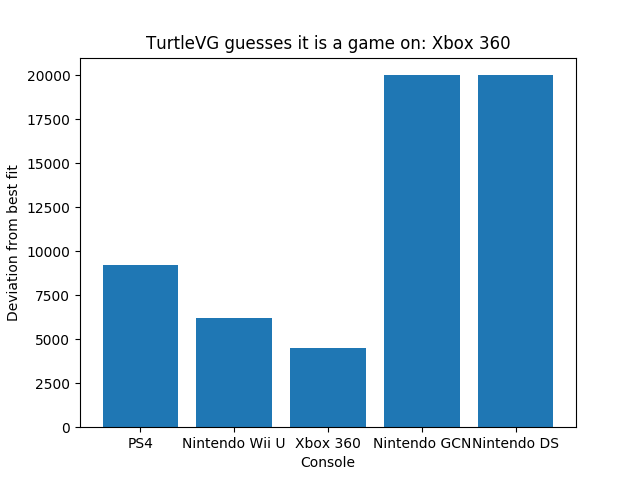

# Installation Guide:

## Setup

We need to setup a Python environment. There are many ways, but to follow along with our example we recommend a virtual machine running ubuntu. 
The following is a step by step guide to setting up a virtual machine Python enviroment and getting everything ready.

### Necessary Software
The editor most of us use is called jupyter and the way to get into that editor is by doing the following:

Get a Bash-like terminal terminal on Windows by installing Git Bash, which can be downloaded from the following link: https://git-scm.com/downloads.
`git clone https://github.com/HelgeCPH/get_things_done_with_python` will cloneinto a new folder, which you do by opening git bash on the selected folder and write git clone.

Next up, we need to handle virtualization. We recommend [Virtual Box](https://www.virtualbox.org/). Download, run and install.
The cloned github repository from earlier contains a Vagrant file. In order to use it you need to get [Vagrant](https://www.vagrantup.com/). Download, run & install.
If you did not get the Vagrant file from the repository, you can find it [here](https://pastebin.com/7XxNfvGZ).


### Virtual Environment

Navigate to the folder containing the cloned github project or the vagrant file you created using the pastebin. Open a terminal here (On Windows, right-click and GitBash here). Finally in the terminal type:
vagrant up

The first installation is heavy and expect it to take up towards an hour. It installs many useful libraries and programs on your Virtual Machine that we will end up using.
On the other side of the installation type:
`vagrant ssh`

to remote connect to your new virtual enviroment. With a little luck, you should see a similar screen to this .

Your environment is now ready, but let's work in a fitting directory, so use the cd command to navigate to:
/python_course/notebooks
once there type
workon course
and you are now ready to create a Python file in the directory and implement our solution.

### Python file creation

You can create a new Python file in various ways. You can open Jupyter in a browser and work from there or alternatively create one from the command line with:
$ touch filename.py
we recommend Jupyter:

You direct to python_course/notebook.
 e e
From the `/python_course/notebooks` directory you should run the command `jupyter notebook --no-browser --ip=0.0.0.0 --NotebookApp.token=''` to start the Jupyter server.
Accessible by opening any browser outside your Virtual Machine and connecting to 127:0:0.8884

Notice that opening a Jupyter server will reserve the ssh connection, which then will be needed to be closed and opened everytime you wish to navigate the terminal. Done by pressing:
ctrl + c and then Y and enter. Alternatively run a second terminal and vagrant ssh from there to have both. 

You are now ready to implement the code below.


# TurtleVG program
We have chosen to name our solution TurtleVG. VG stands for videogame and that is the topic of the day. We have prepared a Python program that can recognize a selection of videogame platforms:
1. PS4
2. Xbox 360
3. Nintendo Gamecube
4. Nintendo DS
5. Nintendo Wii U

The walkthrough will teach you how this was done and enable you to continue the work i.e by implementing additional platforms. The approach is always the same, but requires some work on your end. This work includes preparing platform logos that we compare against. More on this later. 

We have dubbed it turtle because of the speed of the implementation. The program is rather slow at computing. We have put efforts into reducing the run-time of the implementation, but it can still be improved. Improvements include:
1. Using a different approach that color channels and Euclidean distance
2. Improving the implementation of approach #1
3. Improving the quality of the Python code (i.e making it more Pythonic)

The trade-off in our solution is accuracy vs. speed. By increasing the number of crops we compare a videogame with, the more accurate a guess the program will provide, but the slower it will run. With some games, a single crop is enough, but with others we need several. This is because the angles, brightness, blurriness etc. of the image you provide the program with varies. 

## Metaphor
TurtleVG is a Python program that can guess the platform of a videogame by reading an image file you provide it with (of a game). It compares your image against a collection of logos to find the best match. 

## Conceptual Solution
The implementation uses [Euclidean distance](https://en.wikipedia.org/wiki/Euclidean_distance) to determine the distance between image 'A's red, green and blue color channels vs. images 'B': 
```
sum += math.sqrt(((r2-r1)**2)+((g2-g1)**2)+((b2-b1)**2)) # euclidian distance
```
The greater the distance the lesser the similarity between images 'A' & 'B'. This distance is then stored in a list for each platform we compare against. The result is an accuracy value for every platform where the minimum value ( min() ) of the list is the guess TurtleVG makes. 

### Number Of Comparisons
We have a number of blobs that corresponds to every segment of the image you input that passes the criteria we define in a mask. The mask consists of color ranges for the RGB-channel as well as a size (50x50). We try to find blobs that fulfill this criteria. They are then compared as so:

So that every image blob we found is compared against every logo we have for every platform. Our variables are therefore:
1. Imageblobs created by mask (the contours found)
2. Number of logos to compare against (the accuracy vs. speed)
3. Platforms (the more platforms we have to guess, the slower the speed)

#### Visualizaton


#### Improving Speed
Tweak any of the 3 variables we have defined in whatever possible to change the speed. Bear in mind that we may lose accuracy by doing so. We have 2 methods, one that is faster (less comparisons) and one that is slower (more comparisons). Sometimes TurtleVG makes a wrong guess using the faster version. It all depends on the quality of the image you provide and the quality of the implementation.

## Getting The Files

The final project can be found at our public Github repository [Frantic Midnight](https://github.com/DaMexicanJustice/frantic_midnight) and be cloned to your own machine. The folder can then be moved to a virtual machine (in our case Vagrant) and run through a terminal. 

### How To Run

**Make sure the image files you want to test are located in the same directory as the programs. **

**Make sure you type in the terminal: `workon course`**

The usable terminal commands are:
`python prog_main.py <imagefile>`

`python prog_isolate.py <imagefile>`

`python prog_compare.py <imagefile A> <imagefile B>`

#### Example
`python prog_compare farcry4.jpg gta5.jpg`

The above example compares two images and tells you how more they resemble one another (the value output)

## How To Make Cropped Images ([prog_isolate.py](https://github.com/DaMexicanJustice/frantic_midnight/blob/master/exam/code/prog_isolate.py))

First off, we need some sort of reference image, so that we can compare our subject with the actual logoes. To do that, we need to find a way to isolate parts of the image that are unique to the specific platforms. Therefore, it would be obvious to target the respective platform logos (i.e. xbox 360, playstation 4, Wii U etc.). Firstly we need the image, from which we want to extract the unqiue identifier. We call a read function and store it in the program. We create a mask for the image based on color criterias, which we then find all the contours of a certain size, from which we can create our images. At last we hand pick a couple of reference images, some very clear and others a little slurred - which we store locally, so that they are ready for the main part of the program.

**To make your own.** Simply find game images by using a search engine for example [google](http://www.google.com). Then save that image to the same directory as the programs and run prog_isolate.py <your imagefile>. This will generate a number of blobs. Go through them, spot the blob that contains the game logo and add that logo to the corresponding folder. See  [TurtleVG program](# TurtleVG) for which platforms are supported already.

## How To Compare 2 Images ([prog_compare.py](https://github.com/DaMexicanJustice/frantic_midnight/blob/master/exam/code/prog_compare.

Our program for comparison of images has 2 approaches, our initial solution labelled "old_compare" and our other solution "new_compare". Both solutions use a tolerance variable, which determines how much the color may vary from the original. We find the eucledian distance for every pixel in our 50x50 array between the first and the second image.   
[See Conceptual Solution](## Conceptual Solution). For an example of how to compare two images see [example](#### Example)

## Putting Everything Together ([prog_main.py](https://github.com/DaMexicanJustice/frantic_midnight/blob/master/exam/code/
You are now ready to start making TurtleVG guess which platform your game belongs to. Bear in mind that we have no handling of games that are on a platform we do not cover. In other words it will give you a wrong guess. 
To start using TurtleVG simply use it like so:
`python prog_main.py <image file>`

if you run `python prog_main.py blackops.jpg` you should get the following results:

The output should look like the following screenshot:


You may not have a graph show by itself (which is a bug for whatever reason), instead you can locate a file in the same directory as the program called testbarchart.png. It should look something like this:



## Interesting 

Finding contours is a very essential part of the code, used both to extract reference images and for the comparisson between images. It takes the mask and an area size as arguments. Then we use the built in find_contours, which we give 3 arguments: a copy of the frame(mask), cv2.RETR_EXTERNAL and cv2.CHAIN_APPROX_SIMPLE. If the contour is larger or equal to a set size, then we put it into an array. We do this for every contour in the image and then returns the array with all relevant contours. [The code can be found here](https://github.com/DaMexicanJustice/frantic_midnight/blob/master/exam/code/prog_isolate.py).

```Python
def find_contours(frame, area):
    arr = []
    cnts = cv2.findContours(frame.copy(), cv2.RETR_EXTERNAL,cv2.CHAIN_APPROX_SIMPLE)[-2]
    for c in cnts:
        if cv2.contourArea(c) >= area:
            (x,y,w,h) = cv2.boundingRect(c)
            #print(str(x) + ":" + str(w) + ":" + str(y) + ":" + str(h))
            arr.append((x,y,w,h))
            
    return arr
```

The comparisson itself is where we determine how accurate 1 picture is compared to another. For every pixel in the image, assuming the size is 50x50, we calcaulate the eucledian distance between the two images, which gives us a value. The lower the value, the better in terms of accuracy.  


```Python
    for x,y in product(range(50), range(50)):
            pxa = copyfirstpic[x,y]
            pxb = copysecondpic[x,y]
        
            r2 = int(pxa[0])
            r1 = int(pxb[0])
            g2 = int(pxa[1])
            g1 = int(pxb[1])
            b2 = int(pxa[2])
            b1 = int(pxb[2])
        
            sum += math.sqrt(((r2-r1)**2)+((g2-g1)**2)+((b2-b1)**2)) # euclidian distance
        return sum
```

To tie it all together we made a method to find the best match between the image we want to test and the references we have. We create a mask on the image file with an upper and lower RGB or HSV value, as well as the option to dilate and erode. On the mask we find contours based of what platform and size we specified. We run through each and every contour we compare with our reference images and find the reference with the lowest eucledian distance. If the distance is lower than a certain threshold (100 in our case) we automatically assume that we found the right platform. This code is run for every platform to find the likely hood that the image is from that platform.

```Python
def try_detect(image_file, lower, upper, path, masktype, erode=0, dilate=0):
    platform_mask = masktype(image_file, lower, upper, erode, dilate)
    platform_contours = find_contours(platform_mask, 50) # prev was 1
    platform_best_match = ("Unknown", 99999)
    
    verygoodfit = 100
    
    for item in platform_contours:
    
        my_crop = get_crop(item, image_file)
        tmpres = compare_against_v2(my_crop, path )

        if(tmpres[1] < platform_best_match[1]):
            platform_best_match = (tmpres[0], tmpres[1])
        if tmpres[1] < verygoodfit:
            print("Found a good fit, moving on to next.")
            break
    
    
    return platform_best_match
```


